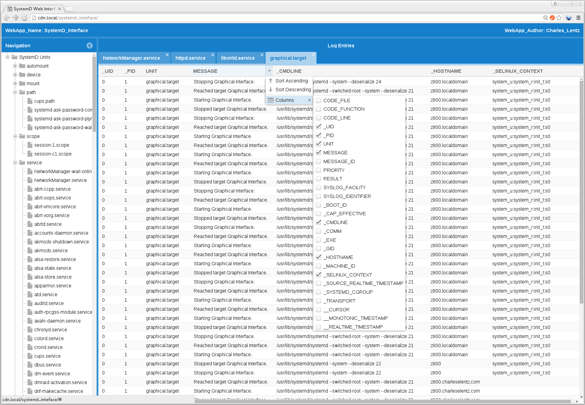
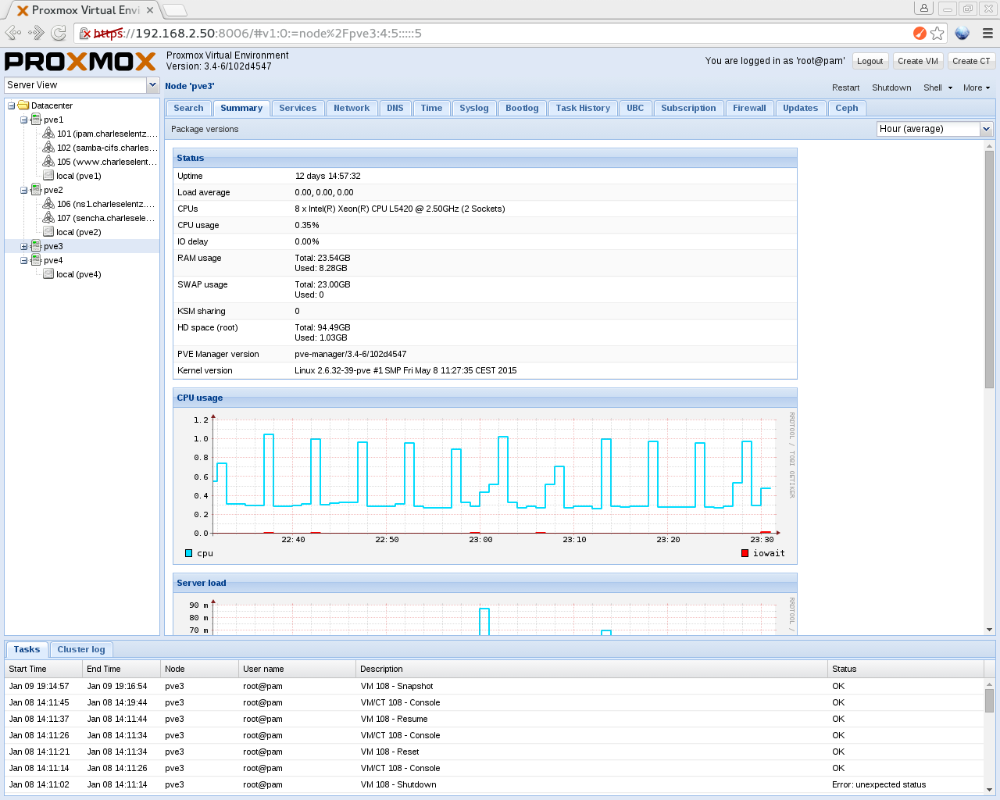

# systemd_web_interface
Web Interface to SystemD, made beautiful with ExtJS framework

Sorry if the code is really unclean and horrible. I'm still pretty new to javascript, and probably just never really got good with shell. 
Probably could've used php or something, but...

This works on my system. It may or may not work on yours. You'll have to try it and see. I'm using Fedora 22.

The awesomeness of the ExtJS framework is better represented in Proxmox.

It's amazing what they've done with it. They've created a full WebApp that looks/feels/operates like a full software suite. 
It's amazing. 

